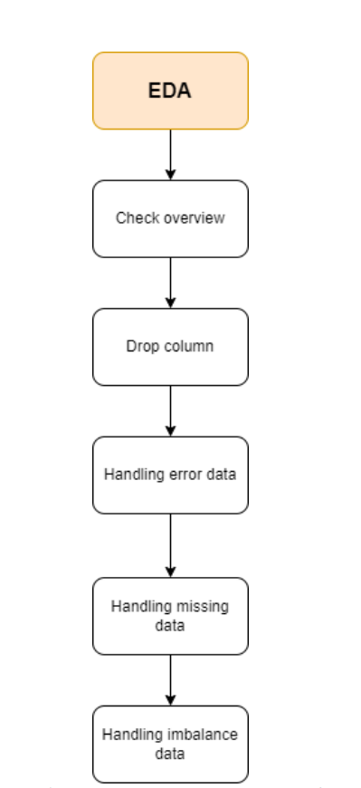
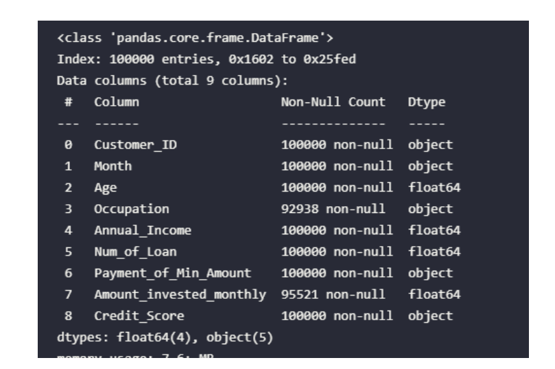
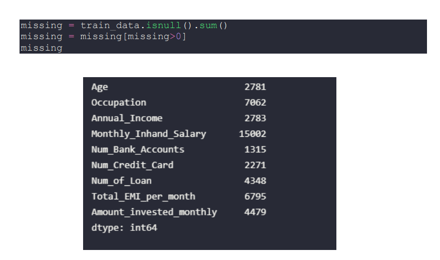
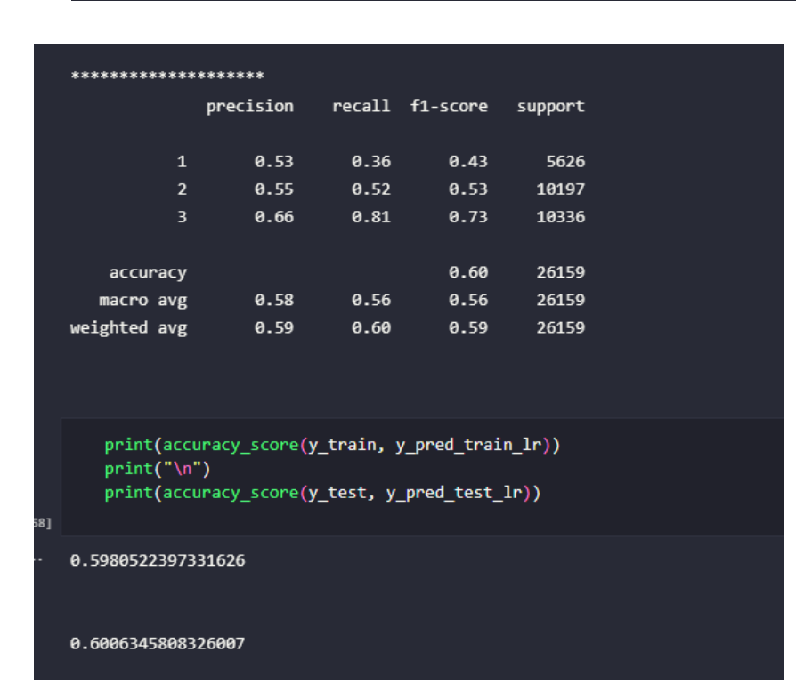
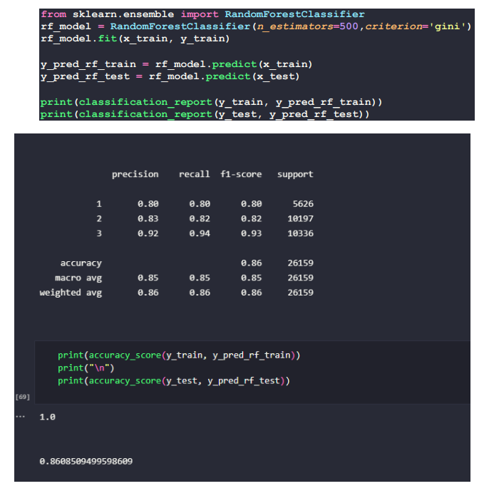

# Machine Learning for Business: CreditScore

This big data project utilizes PySpark and machine learning to build a predictive model for credit scores. 

## Screenshots






## Requirements

- PySpark
- Jupyter Notebook
- Python 3.x

## Installation

### PySpark on Linux Environment

1. Download PySpark from [Apache Spark official website](https://spark.apache.org/downloads.html). Choose the latest stable release, latest releases are very unstable.

2. Extract the downloaded file.

```
tar -xzf spark-3.0.1-bin-hadoop2.7.tgz
```

3. Set `SPARK_HOME` environment variable. You can either set it permanently in `.bashrc` file or set it temporarily for current session.

```
export SPARK_HOME=/path/to/spark-3.0.1-bin-hadoop2.7
```

4. Add PySpark to your `PATH`. You can either add it permanently in `.bashrc` file or add it temporarily for current session.

```
export PATH=$PATH:$SPARK_HOME/bin:$SPARK_HOME/python:$SPARK_HOME/python/pyspark
```

5. Install PySpark using pip.

```
pip install pyspark
```

## Usage

1. Clone this repository to your local machine.

```
git clone https://github.com/khoa25200/machinelearningforbusiness_credirscore.git
```

2. Open the Jupyter Notebook.

```
jupyter notebook
```

3. Navigate to the project folder and open the `credit_score.ipynb` file.

4. Run the code cells to train and test the predictive model.

## Conclusion

This project demonstrates the potential of PySpark and machine learning in building predictive models for business applications such as credit scoring. With the right data and techniques, businesses can utilize these tools to streamline their decision-making processes and improve their overall efficiency.